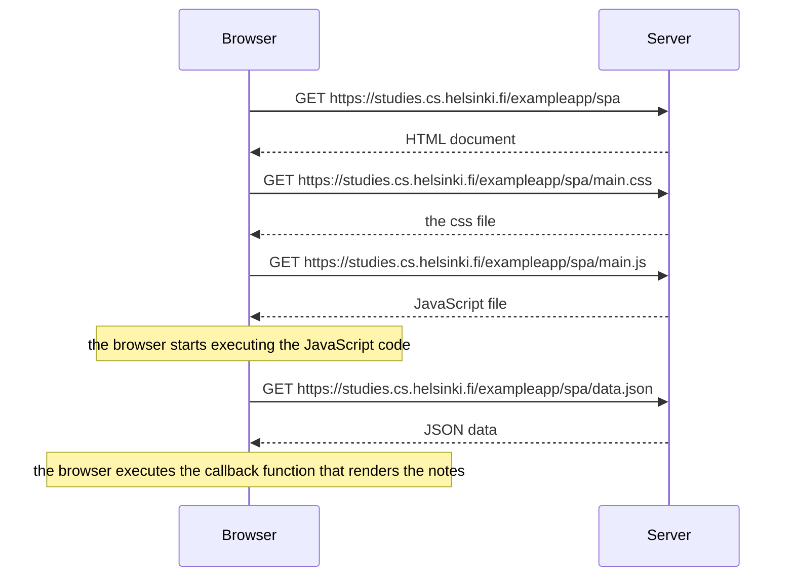

```mermaid
sequenceDiagram
    participant Browser
    participant Server

    Browser->>Server: GET https://studies.cs.helsinki.fi/exampleapp/spa
    Server-->>Browser: HTML document

    Browser->>Server: GET https://studies.cs.helsinki.fi/exampleapp/spa/main.css
    Server-->>Browser: the css file

    Browser->>Server: GET https://studies.cs.helsinki.fi/exampleapp/spa/main.js
    Server-->>Browser: JavaScript file

    Note over Browser: the browser starts executing the JavaScript code

    Browser->>Server: GET https://studies.cs.helsinki.fi/exampleapp/spa/data.json
    Server-->>Browser: JSON data

    Note over Browser: the browser executes the callback function that renders the notes
```