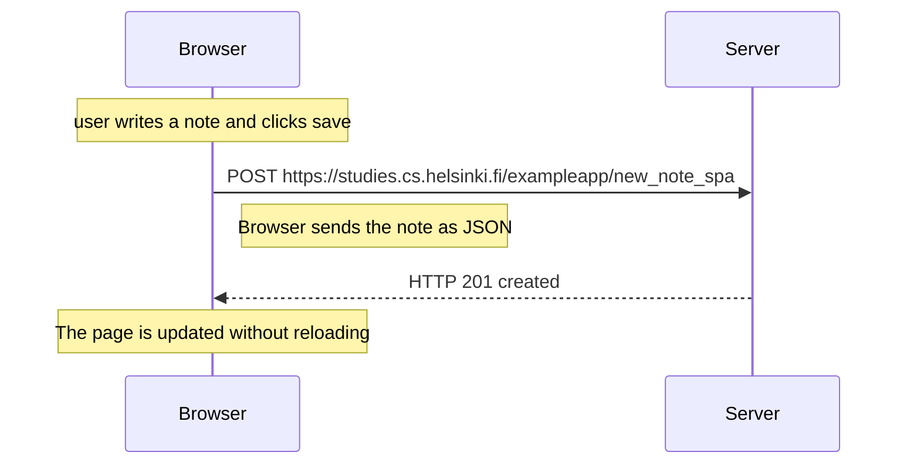

```mermaid
sequenceDiagram
    participant Browser
    participant Server

    Note over Browser: user writes a note and clicks save

    Browser->>Server: POST https://studies.cs.helsinki.fi/exampleapp/new_note_spa
    Note right of Browser: Browser sends the note as JSON
    Server-->>Browser: HTTP 201 created
    

    Note over Browser: The page is updated without reloading
    
```